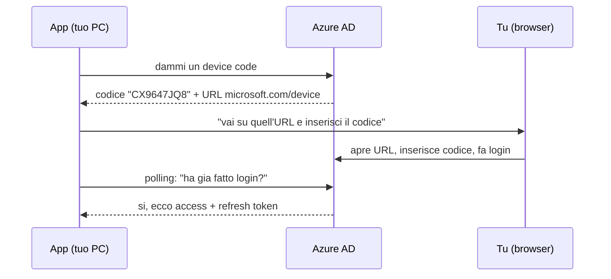
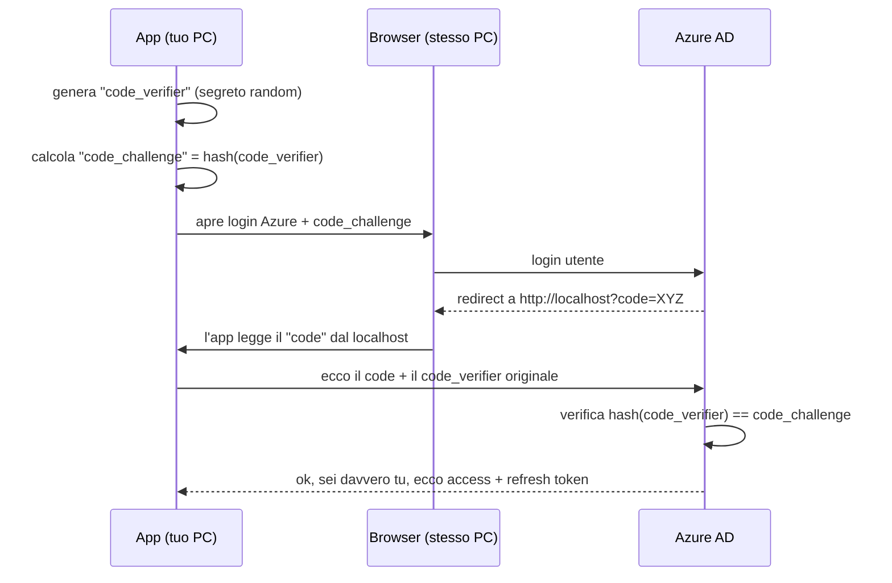

# Metodi di autenticazione Azure AD (Entra ID) — ripasso

Prima i concetti base, poi i flussi, poi dove sta il problema.

## Concetti di base

**OAuth 2.0 / OpenID Connect**: standard dietro tutto. La tua app non riceve mai la password dell'utente. Riceve un **token** (stringa firmata) che dice "questo utente ti autorizza ad accedere a queste risorse (scope) per un po' di tempo".

Tre token in gioco:

- **Access token**: il pass d'ingresso verso Graph API. Vita corta (~1h).
- **Refresh token**: serve a ottenere un nuovo access token senza rifare il login. Vita lunga (giorni/settimane). È quello salvato nel tuo `.token-cache.json`.
- **ID token**: dice *chi* è l'utente (non usato per chiamare API).

**Scope**: i permessi richiesti (es. `Mail.Read`, `Calendars.Read`). I tuoi sono in `config.scopes`.

**Grant type / flow**: il *modo* in cui l'app ottiene il token. Qui sta tutta la differenza. Microsoft può applicare regole di sicurezza (Conditional Access) per *tipo di flusso*.

## I flussi rilevanti per la tua app

La tua è una **app pubblica** (gira sul tuo PC, non ha un server segreto sicuro dove nascondere una password). Quindi niente "client secret". Le app pubbliche usano flussi pensati per questo.

### 1. Device Code Flow ← quello che usi ORA (e che è bloccato)

Pensato per dispositivi senza browser/tastiera comoda (smart TV, CLI su server headless).

**Il problema di sicurezza**: l'app che chiede il codice e l'utente che lo inserisce sono **scollegati**. Un attaccante può generare un codice sul *suo* PC e ingannarti via mail/Teams ("inserisci questo codice per accedere a X"). Tu lo inserisci, fai login col tuo account, e **il token finisce sul PC dell'attaccante**. Questo è esattamente l'attacco Kali365/PHaaS. Per questo IT l'ha bloccato a livello tenant.

### 2. Authorization Code Flow + PKCE ← la soluzione consigliata

Il flusso standard per app pubbliche moderne. La differenza chiave: il browser si apre sul TUO stesso PC e il token torna direttamente all'app locale tramite un redirect su `http://localhost`. Niente codice da copia-incollare, quindi niente phishing.

## Cos'è PKCE (il pezzo che non ricordavi)

**PKCE** = *Proof Key for Code Exchange*, si pronuncia "pixie". È una protezione aggiunta all'authorization code flow per le app pubbliche.

Il problema che risolve: nel flusso, Azure rimanda il "code" via redirect al browser. Su un PC condiviso/compromesso, un'altra app malevola potrebbe **intercettare quel code** e provare a scambiarlo per un token.

Come lo blocca PKCE, in 3 mosse:

1. **Prima** di iniziare, l'app inventa un segreto casuale: il `code_verifier`.
2. Ne calcola un hash (SHA-256): il `code_challenge`. Manda solo l'**hash** ad Azure nella richiesta di login.
3. Quando l'app scambia il code per il token, deve allegare il `code_verifier` **originale**. Azure ricalcola l'hash e verifica che corrisponda.

Risultato: anche se qualcuno ruba il "code" dal redirect, **non ha il `code_verifier`** (è rimasto in memoria nell'app originale, mai trasmesso in chiaro). Senza quello, il code è inutile. È come consegnare il lucchetto pubblicamente ma tenere la chiave in tasca.

Analogia veloce: prenoti un pacco dando un hash di una parola d'ordine. Quando lo ritiri, devi dire la parola vera. Chi ha visto l'hash non può ritirare il pacco.

## Confronto secco

| | Device Code | Auth Code + PKCE |
|---|---|---|
| Browser dove? | Qualsiasi dispositivo | **Stesso PC dell'app** |
| Token consegnato come? | Polling dopo login manuale | Redirect su `localhost` |
| Vulnerabile a phishing del codice? | **Sì** (Kali365) | No |
| Bloccato dalla policy IT? | **Sì** | No |
| Esperienza utente | Copia-incolla codice | Si apre browser, fai login, fine |

## Perché Auth Code + PKCE risolve il TUO caso

La policy di IT blocca un **grant type specifico** (device code). Auth Code + PKCE è un grant type diverso e non phishabile, quindi non rientra nel blocco. Cambi flusso nel codice, niente eccezioni di sicurezza da chiedere, e l'app resta self-service (si apre il browser da sola).

Unica cosa da preparare lato Azure: aggiungere un **redirect URI** `http://localhost` all'App Registration (sezione *Mobile and desktop applications*), così Azure sa che può rimandare il code alla tua app locale.

---

Quando vuoi procedere col codice, le due strade restano:

- **`@azure/identity` `InteractiveBrowserCredential`** — libreria Microsoft che fa tutto (apre browser, server localhost, PKCE, cache token). Poche righe, una dipendenza nuova.
- **MSAL a mano** — più codice ma zero dipendenze nuove, mantieni il tuo cache plugin attuale.

Dimmi se vuoi che proceda e quale strada.
