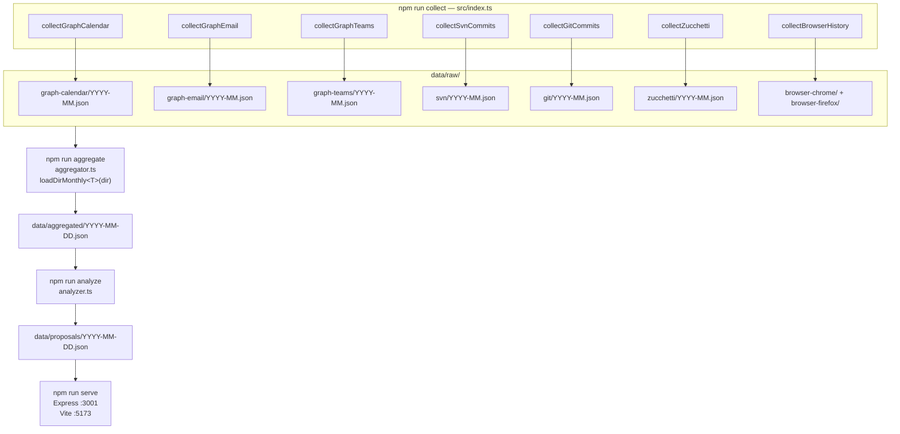
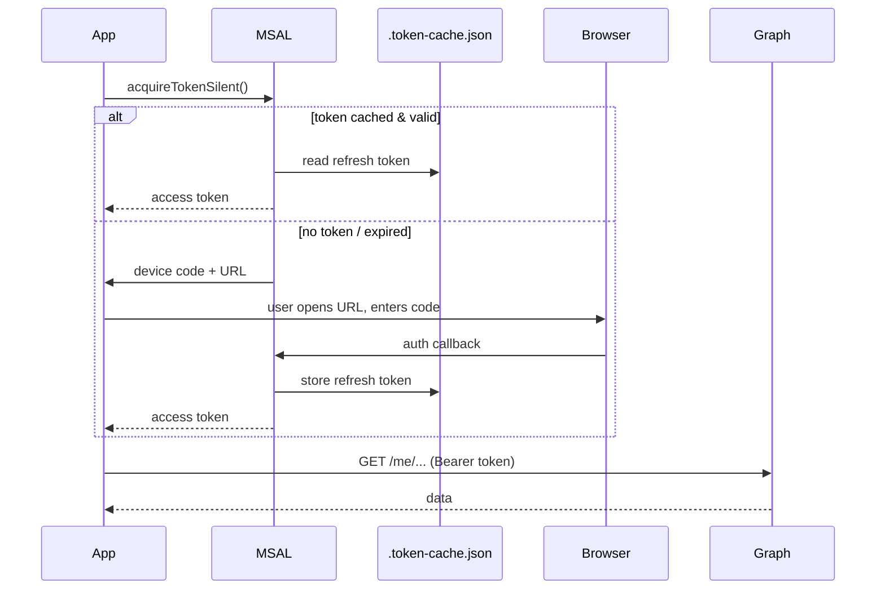
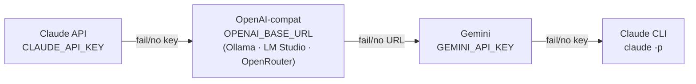
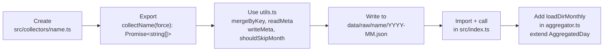

# Developer Guide

→ [README](./README.md) | [Functional overview](./FUNCTIONAL.md)

---

## Repository layout

```
my_ms_graph_api_collector/
├── src/
│   ├── index.ts                        # collect entrypoint (npm run collect)
│   ├── graphClient.ts                  # MSAL device-code auth + Graph client
│   ├── collectors/
│   │   ├── utils.ts                    # shared: mergeByKey, skip/force, .meta.json
│   │   ├── graph/
│   │   │   ├── calendar.ts             # /me/calendarView → data/raw/graph-calendar/
│   │   │   ├── email.ts                # /me/messages    → data/raw/graph-email/
│   │   │   └── teams.ts                # /me/chats/*/messages → data/raw/graph-teams/
│   │   ├── vcs/
│   │   │   ├── git.ts                  # git log (GIT_ROOTS) → data/raw/git/
│   │   │   └── svn.ts                  # svn log (SVN_URL)   → data/raw/svn/
│   │   ├── zucchetti/
│   │   │   ├── index.ts                # collector orchestrator
│   │   │   ├── session.ts              # shared Playwright login + navigation
│   │   │   ├── scraper.ts              # scrapeCartellino, scrapeSingleDay
│   │   │   ├── updateData.ts           # submit activity requests to Zucchetti
│   │   │   └── getTimesheet.ts         # CLI: full month extraction
│   │   ├── browser/
│   │   │   └── history.ts              # SQLite (Chrome+Firefox) → data/raw/browser-*/
│   │   └── nibol/
│   │       └── index.ts                # Playwright — desk booking + calendar fetch
│   ├── analysis/
│   │   ├── aggregator.ts               # npm run aggregate → data/aggregated/
│   │   ├── analyzer.ts                 # orchestrator + fallback chain (Claude → Gemini → CLI)
│   │   ├── prompts.ts                  # prompt templates
│   │   ├── claudeProvider.ts           # Anthropic API + OpenAI-compat backends
│   │   └── geminiProvider.ts           # Google Generative AI SDK
│   ├── server/
│   │   ├── app.ts                      # Express server (port 3001)
│   │   └── routes/
│   │       ├── week.ts                 # GET /api/week/:date, GET /api/week/:date/tp-hours, POST /api/week/:date/submit
│   │       ├── analyze.ts              # POST /api/analyze/:date (async + job tracking)
│   │       ├── proposals.ts            # GET/PATCH /api/proposals/:date
│   │       ├── submit.ts               # POST /api/submit/:date (proposal-based)
│   │       ├── zucchetti.ts            # GET /api/zucchetti/*
│   │       ├── hooks.ts                # POST /api/hooks/{zucchetti,nibol}
│   │       ├── signals.ts              # GET /api/day/:date — per-day activity signals
│   │       └── sync.ts                 # GET /api/sync/* — sync utilities
│   └── targetprocess/
│       ├── client.ts                   # TargetProcess REST v1 client
│       ├── collector.ts                # KB update (npm run kb:update) — Claude + Gemini providers inside
│       ├── prompts.ts                  # TP AI prompts
│       ├── format.ts                   # hhmmToHours, parseTpDate helpers
│       └── types.ts                    # TP entity interfaces
├── web/                                # Vue 3 + Vite + Pinia — Activity Portal
│   └── src/
│       ├── App.vue                     # root: sidebar + day-picker header + views
│       ├── router/index.ts             # hash-history router — /:view/:date
│       ├── views/PortalView.vue        # view switcher (dashboard/timesheet/activity/teams/browser)
│       ├── types/index.ts              # shared TypeScript interfaces
│       ├── api.ts                      # fetch wrappers for all /api/* endpoints
│       ├── stores/
│       │   ├── usePickerStore.ts       # month/day selection, localStorage persistence
│       │   ├── useTimesheetStore.ts    # week data, hoursEdits, submit(Week|Day)Hours
│       │   ├── useDayStore.ts          # day view: US cards, timeline, quick log
│       │   ├── useUiStore.ts           # view state, filter/sort for quickLog + pinned
│       │   └── useAnalysisStore.ts     # AI analysis job tracking
│       └── components/
│           ├── layout/
│           │   ├── AppSidebar.vue      # left nav (5 views)
│           │   └── DayPickerHeader.vue # month nav + scrollable day buttons
│           ├── dashboard/
│           │   ├── StatStrip.vue       # 6 KPI cards — Commit/Meeting cards navigate to detail views
│           │   ├── WeekStrip.vue       # 5 week-day cards with rend status
│           │   ├── TimelinePanel.vue   # hour-by-hour event timeline
│           │   ├── WorkTpPanel.vue     # US cards + "Invia a TP" + Log rapido (filter/sort/search)
│           │   ├── SignalsGrid.vue     # 2×2: email, Teams→/teams, browser→/browser, git→/activity
│           │   └── NoteEdit.vue        # inline note editor
│           ├── timesheet/
│           │   ├── TsHeader.vue        # column headers (Mon-Fri + weekend)
│           │   ├── TsTotals.vue        # Ore TP / Zuc / Delta rows (includes pinned in sum)
│           │   ├── TsTpBar.vue         # toolbar: Verifica, Analizza, Invia a TP
│           │   ├── TimesheetTable.vue  # active rows + pinned section with filter/sort toolbar
│           │   ├── TsRow.vue           # single timesheet row
│           │   └── TsNoteCell.vue      # per-cell floating note editor
│           └── TimeCellWidget.vue      # − value + smart ±0.5 increment (shared)
├── scripts/
│   ├── tp/                             # Standalone TP CLI tools (ts-node)
│   ├── nibol/                          # Nibol desk booking scripts (tsx): book_desk.ts, getCalendar.ts
│   ├── morning-automation.ps1          # Daily 08:30 Windows Task Scheduler automation
│   ├── schedule-morning.ps1            # One-time setup: register the scheduled task
│   ├── bootstrap-env.ps1               # Generate .env from Azure App Registration
│   ├── launch-nibol-setup.ps1          # Interactive Nibol browser profile setup
│   ├── analyze-ollama-remote.sh        # Remote Ollama analysis helper
│   ├── rewrite_git_commit.sh           # Git commit history rewrite utility
│   ├── test-nibol.ts                   # Nibol connection test
│   ├── test-standup-paginate.ts        # Standup pagination test
│   ├── test-teams-filter.ts            # Teams filter test
│   └── test-teams-thursday.ts          # Teams Thursday test
├── docs/
│   ├── OPERATOR.md                     # Operator runbook — 10 use cases
│   ├── DATA-STRATEGY.md                # Collection + aggregation + analysis strategy
│   ├── azure-guide.md                  # Azure App Registration setup
│   ├── plans/                          # Implementation planning docs
│   └── archive/                        # Legacy files (portal.html)
├── config/
│   ├── defaults.json                   # Recurring activities for timesheet
│   └── hooks.json                      # Automation hook configuration
├── data/                               # gitignored — runtime data (raw/aggregated/proposals/kb)
├── .env.example
├── CLAUDE.md
├── DEVELOPER.md
└── package.json
```

---

## Scripts reference

| Category | Script | When to run |
|----------|--------|-------------|
| **Pipeline** | `npm run collect` | Fetch all raw data from all sources |
| | `npm run collect -- --date=YYYY-MM-DD` | Fetch a single day only |
| | `npm run collect -- --force` | Re-fetch ignoring skip cache |
| | `npm run aggregate` | Build per-day `data/aggregated/` bundles |
| | `npm run analyze -- --date=YYYY-MM-DD` | AI analysis for one day (Claude→Gemini→CLI) |
| | `npm run analyze:claude / :gemini / :cli` | Force a specific AI provider |
| | `npm run all` | Full pipeline: collect → aggregate → analyze → serve |
| **Server / Dev** | `npm run serve` | Express API server on port 3001 |
| | `cd web && npm run dev` | Vite dev server on port 5173 (proxies /api → 3001) |
| **Operator CLI** | `npm run zucchetti:get` | Extract current month timesheet from Zucchetti |
| | `npm run zucchetti:get:date` | Extract a specific month (edit script for dates) |
| | `npm run nibol:book` | Book desk for today |
| | `npm run nibol:book:date` | Book desk for a specific date |
| | `npm run nibol:calendar` | Fetch/test Nibol calendar data |
| | `npm run nibol:status` | Test Nibol connectivity |
| **TP CLI** | `npm run tp:log-time` | Log time entry to TargetProcess |
| | `npm run tp:projects` | List TP projects |
| | `npm run tp:userstories` | List TP user stories |
| | `npm run tp:us-detail` | Get TP user story detail |
| **AI Knowledge Base** | `npm run kb:update` | Update TP US knowledge base (Claude) |
| | `npm run kb:update:gemini` | Update KB via Gemini |
| | `npm run kb:update:gemini:force` | Force full KB rebuild |
| **Scheduled** | `scripts/morning-automation.ps1` | Runs automatically at 08:30 on weekdays via Task Scheduler (smart working + Nibol booking) |

---

## Data flow



---

## Authentication — Microsoft Graph



**Required App Registration settings:**
- Authentication → "Allow public client flows" → **Yes**
- Delegated permissions: `Mail.Read`, `Calendars.Read`, `Chat.Read`, `Chat.ReadWrite`

---

## Skip / force logic

```mermaid
flowchart TD
    START([For each month M\nfrom COLLECT_SINCE to today])
    FORCE{--force\npassed?}
    CURRENT{M == current\nmonth?}
    META{meta[M].lastExtractedDate\n>= lastDayOfMonth\nAND sources match?}
    SKIP[Skip month]
    FETCH[Fetch + merge\nwrite YYYY-MM.json\nupdate .meta.json]

    START --> FORCE
    FORCE -->|yes| FETCH
    FORCE -->|no| CURRENT
    CURRENT -->|yes| FETCH
    CURRENT -->|no| META
    META -->|yes| SKIP
    META -->|no| FETCH
```

Teams uses per-chat state instead of `.meta.json` — see [FUNCTIONAL.md](./FUNCTIONAL.md#data-sources).

---

## Environment variables

Copy `.env.example` to `.env`:

| Variable | Required | Description |
|---|---|---|
| `TENANT_ID` | ✅ | Azure Entra ID tenant |
| `CLIENT_ID` | ✅ | App Registration client ID |
| `TOP` | — | Graph API page size (default 50) |
| `COLLECT_SINCE` | — | Historical start date (default 2025-01-01) |
| `TP_BASE_URL` | ✅ | TargetProcess instance URL |
| `TP_TOKEN` | ✅ | Base64 TP API token |
| `MISC_TASK_ID` | — | Fallback TP task for unattributed hours |
| `SERVER_PORT` | — | Express server port (default `3001`) |
| `CLAUDE_API_KEY` | — | Anthropic API key — **backend 1** |
| `CLAUDE_MODEL` | — | Anthropic model ID (default `claude-haiku-4-5-20251001`) |
| `CLAUDE_MODEL_MAX_TPM` | — | Claude token budget in chars (default `200000`) |
| `OPENAI_BASE_URL` | — | OpenAI-compatible base URL — **backend 2**: Ollama (`http://localhost:11434/v1`), LM Studio, OpenRouter, etc. |
| `OPENAI_API_KEY` | — | API key for the OpenAI-compatible endpoint (Ollama: any string) |
| `OPENAI_MODEL` | — | Model name for the OpenAI-compatible endpoint (e.g. `qwen2.5-coder:3b`) |
| `OPENAI_MODEL_MAX_TPM` | — | Token budget for OpenAI-compat endpoint (default `5000`) |
| `OPENAI_NUM_CTX` | — | Ollama context window in tokens (default: `OPENAI_MODEL_MAX_TPM`) |
| `OPENAI_REQUEST_TIMEOUT_MS` | — | Request timeout for OpenAI-compat endpoint (default `900000` = 15 min) |
| `GEMINI_API_KEY` | — | Google Generative AI API key — **backend 3** |
| `GEMINI_MODEL` | — | Gemini model ID (default `gemini-2.0-flash`) |
| `GEMINI_MODEL_MAX_TPM` | — | Gemini token budget (default `1000000`) |
| `KB_RELEVANCE_WINDOW_DAYS` | — | Days window for KB relevance filtering in analyzer (default `90`) |
| `GIT_ROOTS` | — | Semicolon-separated root dirs to scan for git repos (maxDepth 4). Supports Windows paths and WSL UNC paths: `//wsl.localhost/Ubuntu/home/<user>/projects` |
| `GIT_EMAILS` | — | Semicolon-separated author emails to include; empty = all authors |
| `SVN_URL` | — | SVN repository URL |
| `SVN_USERNAME` / `SVN_PASSWORD` | — | SVN credentials; `SVN_USERNAME` is also used as author filter |
| `SVN_BIN` | — | Path to `svn.exe` |
| `ZUCCHETTI_USERNAME` / `ZUCCHETTI_PASSWORD` | — | Zucchetti form auth |
| `NIBOL_PROFILE_DIR` | — | Playwright session dir for Nibol |
| `CHROME_PROFILE_DIRS` | — | Semicolon-separated Chrome profile dirs |
| `FIREFOX_PROFILE_DIR` | — | Firefox profile dir |

### AI analyzer backends

`analyzer.ts` builds the provider chain in priority order (first available wins):



All 4 providers run an `isAvailable()` probe at startup. Only reachable providers enter the active chain.

---

## Running the stack

```bash
# Backend only
npx tsx src/server/app.ts

# Frontend dev server (proxies /api → localhost:3001)
cd web && npm run dev

# Full pipeline
npm run all

# Single-day update
npm run collect -- --date=2026-03-11
npm run aggregate
npm run analyze -- --date=2026-03-11

# Force re-fetch everything
npm run collect -- --force
```

---

## Adding a new collector



---

## TypeScript

```bash
npx tsc --noEmit       # type-check — must be 0 errors before commit
npx tsx src/index.ts   # run without compile step
```

The project is `"type": "commonjs"`. `tsx` handles TypeScript transpilation at runtime; there is no build step for the backend.
