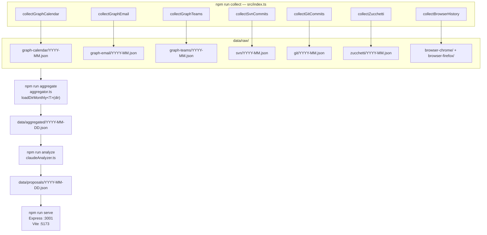
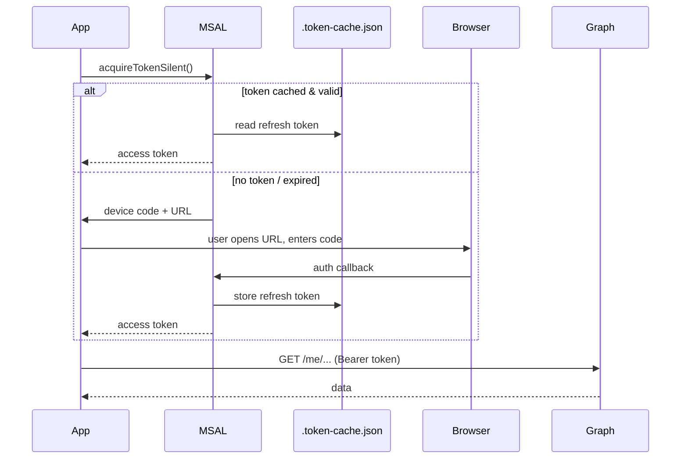
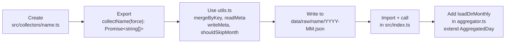

# Developer Guide

→ [README](./README.md) | [Functional overview](./FUNCTIONAL.md)

---

## Repository layout

```
my_ms_graph_api_collector/
├── src/
│   ├── index.ts                      # collect entrypoint (npm run collect)
│   ├── graphClient.js                # MSAL device-code auth + Graph client (CJS)
│   ├── collectors/
│   │   ├── utils.ts                  # shared: mergeByKey, skip/force logic, .meta.json
│   │   ├── graph-calendar.ts         # /me/calendarView → data/raw/graph-calendar/
│   │   ├── graph-email.ts            # /me/messages    → data/raw/graph-email/
│   │   ├── graph-teams.ts            # /me/chats/*/messages → data/raw/graph-teams/
│   │   ├── git-commits.ts            # git log (GIT_ROOTS) → data/raw/git/
│   │   ├── svn-commits.ts            # svn log (SVN_URL)   → data/raw/svn/
│   │   ├── zucchetti.ts              # Playwright scraper  → data/raw/zucchetti/
│   │   ├── browser-history.ts        # SQLite (Chrome+Firefox) → data/raw/browser-*/
│   │   └── nibol.ts                  # Playwright — desk booking
│   ├── analysis/
│   │   ├── aggregator.ts             # npm run aggregate → data/aggregated/
│   │   └── claudeAnalyzer.ts         # npm run analyze   → data/proposals/
│   ├── server/
│   │   ├── app.ts                    # Express server (port 3001)
│   │   └── routes/
│   │       ├── proposals.ts          # GET/PATCH /api/proposals/:date
│   │       ├── submit.ts             # POST /api/submit/:date
│   │       └── hooks.ts              # POST /api/hooks/{zucchetti,nibol}
│   └── targetprocess/
│       ├── client.ts                 # TargetProcess REST v1 client
│       ├── collector.ts              # KB update (npm run kb:update)
│       ├── format.ts                 # hhmmToHours, parseTpDate helpers
│       └── types.ts                  # TP entity interfaces
├── web/                              # Vue 3 + Vite + Pinia — Activity Portal
│   └── src/
│       ├── App.vue                   # root: sidebar + day-picker header + views
│       ├── main.ts                   # Vite entry — registers Pinia + style.css
│       ├── style.css                 # DaisyUI v5 / Tailwind v4 custom classes
│       ├── types/index.ts            # shared TypeScript interfaces
│       ├── mock/data.ts              # mock data + WORKDAY_HOURS / HALF_WORKDAY_HOURS
│       ├── stores/
│       │   ├── usePickerStore.ts     # month/day selection, localStorage persistence
│       │   ├── useTimesheetStore.ts  # weekly timesheet, hoursEdits, fillDay()
│       │   ├── useDayStore.ts        # day view: US cards, timeline, quick log
│       │   └── useUiStore.ts         # view switching, UI toggles
│       └── components/
│           ├── layout/
│           │   ├── AppSidebar.vue    # left nav (5 views)
│           │   └── DayPickerHeader.vue # month nav + scrollable day buttons
│           ├── dashboard/
│           │   ├── StatStrip.vue     # 5 KPI cards (commits, meetings, email, …)
│           │   ├── WeekStrip.vue     # 5 week-day cards with rend status
│           │   ├── DayHeader.vue     # selected day title + location badge
│           │   ├── TimelinePanel.vue # hour-by-hour event timeline
│           │   ├── WorkTpPanel.vue   # US cards + quick log (filter/sort/search)
│           │   ├── SignalsGrid.vue   # 2×2: email, Teams, browser, git/svn
│           │   ├── TimeCellWidget.vue # − value + widget with smart ±increment
│           │   └── NoteEdit.vue      # inline note editor
│           └── timesheet/
│               ├── TimesheetView.vue # toolbar: WE toggle, quick-fill, Verifica
│               ├── TimesheetTable.vue # weekly table with colgroup sync
│               ├── TsRow.vue         # single timesheet row
│               ├── TsNoteCell.vue    # per-cell floating note editor
│               └── TimeCellWidget.vue # reused from dashboard/
├── data/                             # gitignored — runtime data
├── zucchetti_automation/             # Playwright scripts (plain JS)
├── scripts/                          # one-off test/utility scripts
├── .env.example
├── CLAUDE.md
└── package.json
```

---

## Data flow



---

## Authentication — Microsoft Graph



**Required App Registration settings:**
- Authentication → "Allow public client flows" → **Yes**
- Delegated permissions: `Mail.Read`, `Calendars.Read`, `Chat.Read`, `Chat.ReadWrite`

---

## Skip / force logic

```mermaid
flowchart TD
    START([For each month M\nfrom COLLECT_SINCE to today])
    FORCE{--force\npassed?}
    CURRENT{M == current\nmonth?}
    META{meta[M].lastExtractedDate\n>= lastDayOfMonth\nAND sources match?}
    SKIP[Skip month]
    FETCH[Fetch + merge\nwrite YYYY-MM.json\nupdate .meta.json]

    START --> FORCE
    FORCE -->|yes| FETCH
    FORCE -->|no| CURRENT
    CURRENT -->|yes| FETCH
    CURRENT -->|no| META
    META -->|yes| SKIP
    META -->|no| FETCH
```

Teams uses per-chat state instead of `.meta.json` — see [FUNCTIONAL.md](./FUNCTIONAL.md#data-sources).

---

## Environment variables

Copy `.env.example` to `.env`:

| Variable | Required | Description |
|---|---|---|
| `TENANT_ID` | ✅ | Azure Entra ID tenant |
| `CLIENT_ID` | ✅ | App Registration client ID |
| `TOP` | — | Graph API page size (default 50) |
| `COLLECT_SINCE` | — | Historical start date (default 2025-01-01) |
| `TP_BASE_URL` | ✅ | TargetProcess instance URL |
| `TP_TOKEN` | ✅ | Base64 TP API token |
| `MISC_TASK_ID` | — | Fallback TP task for unattributed hours |
| `CLAUDE_API_KEY` | — | Anthropic API key — **backend 1** (see below) |
| `CLAUDE_MODEL` | — | Anthropic model ID (default `claude-haiku-4-5-20251001`) |
| `OPENAI_BASE_URL` | — | OpenAI-compatible base URL — **backend 2**: Ollama (`http://localhost:11434/v1`), LM Studio, OpenRouter, etc. |
| `OPENAI_API_KEY` | — | API key for the OpenAI-compatible endpoint (Ollama: any string) |
| `OPENAI_MODEL` | — | Model name for the OpenAI-compatible endpoint (e.g. `llama3.2`) |
| `GIT_ROOTS` | — | Semicolon-separated root dirs to scan for git repos (maxDepth 4). Supports Windows paths and WSL UNC paths: `//wsl.localhost/Ubuntu/home/<user>/projects` |
| `GIT_EMAILS` | — | Semicolon-separated author emails to include; empty = all authors |
| `SVN_URL` | — | SVN repository URL |
| `SVN_USERNAME` / `SVN_PASSWORD` | — | SVN credentials; `SVN_USERNAME` is also used as author filter |
| `SVN_BIN` | — | Path to `svn.exe` |
| `ZUCCHETTI_USERNAME` / `ZUCCHETTI_PASSWORD` | — | Zucchetti form auth |
| `NIBOL_PROFILE_DIR` | — | Playwright session dir for Nibol |
| `CHROME_PROFILE_DIRS` | — | Semicolon-separated Chrome profile dirs |
| `FIREFOX_PROFILE_DIR` | — | Firefox profile dir |

### AI analyzer backends

`claudeAnalyzer.ts` selects the LLM backend in priority order:

```mermaid
flowchart TD
    A{CLAUDE_API_KEY set?}
    B[Anthropic SDK\nPay-per-token API]
    C{OPENAI_BASE_URL set?}
    D[OpenAI-compatible HTTP\nOllama · LM Studio · OpenRouter]
    E[claude CLI  -p \nClaude Code subscription]

    A -->|yes| B
    A -->|no|  C
    C -->|yes| D
    C -->|no|  E
```

---

## Running the stack

```bash
# Backend only
npx tsx src/server/app.ts

# Frontend dev server (proxies /api → localhost:3001)
cd web && npm run dev

# Full pipeline
npm run all

# Single-day update
npm run collect -- --date=2026-03-11
npm run aggregate
npm run analyze -- --date=2026-03-11

# Force re-fetch everything
npm run collect -- --force
```

---

## Adding a new collector



---

## TypeScript

```bash
npx tsc --noEmit       # type-check — must be 0 errors before commit
npx tsx src/index.ts   # run without compile step
```

The project is `"type": "commonjs"`. `tsx` handles TypeScript transpilation at runtime; there is no build step for the backend.
