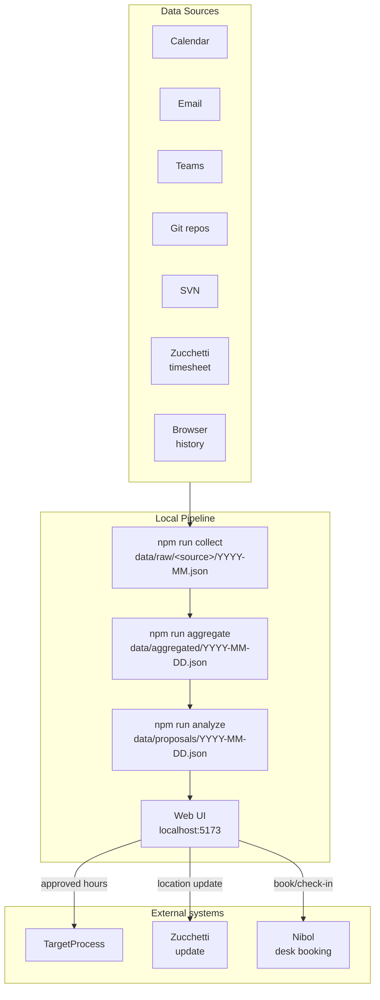
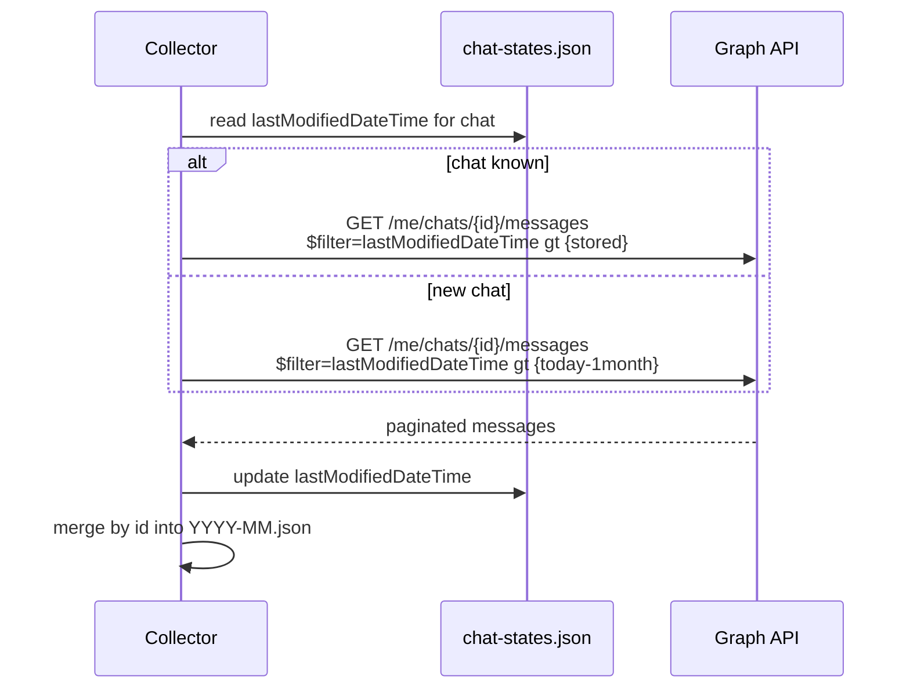
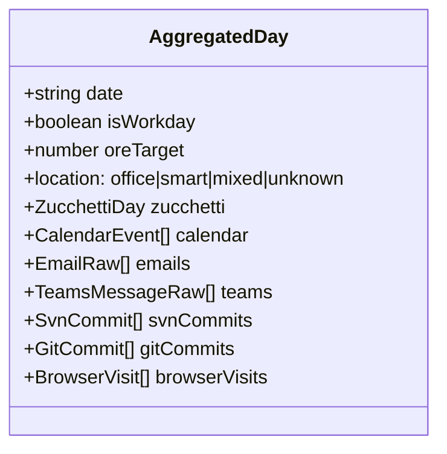
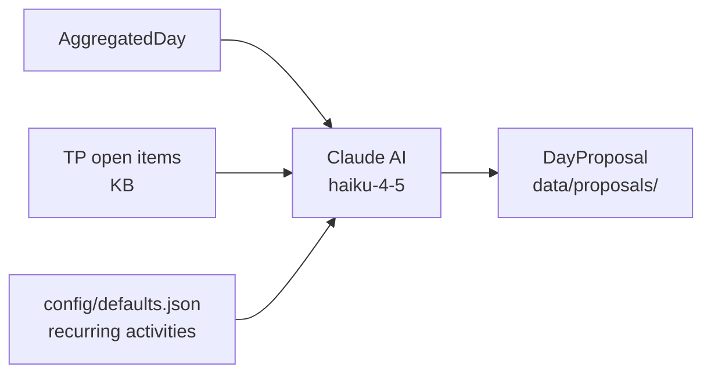
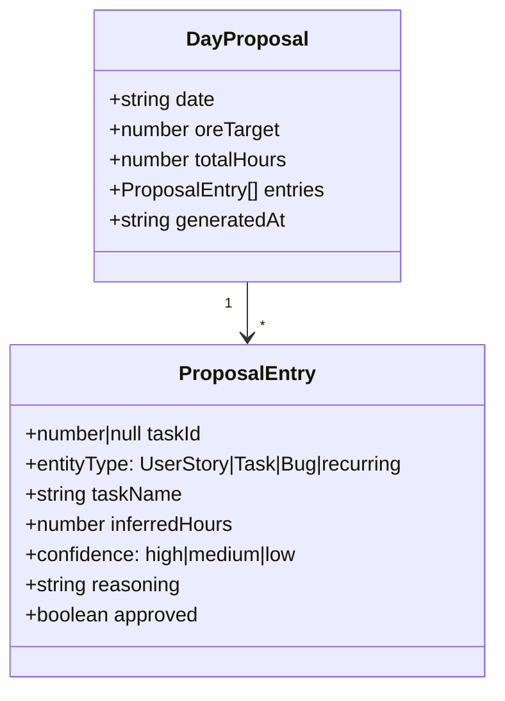
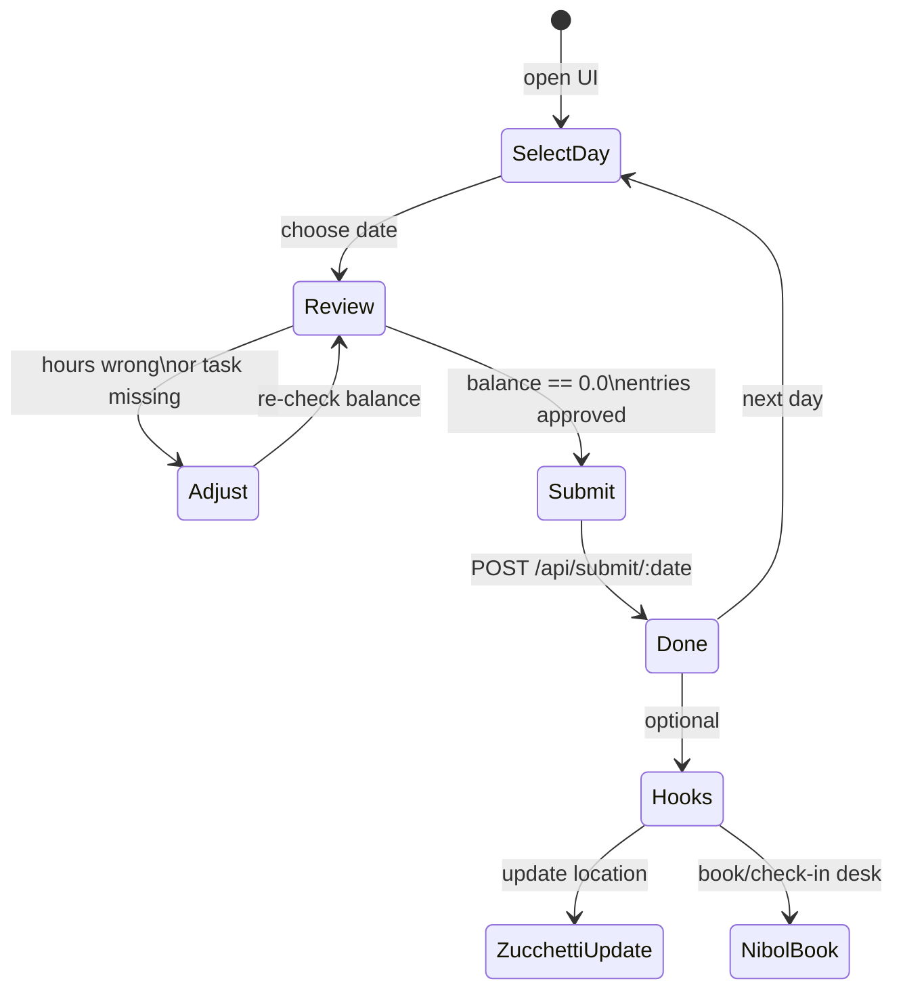
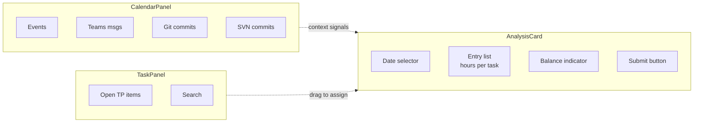
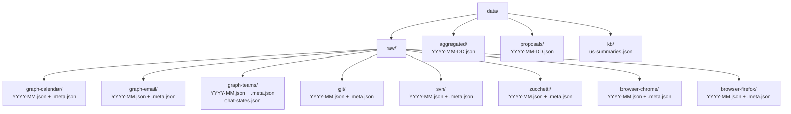

# Functional Overview

→ [README](./README.md) | [Developer guide](./DEVELOPER.md)

---

## Problem statement

Logging hours in TargetProcess manually at the end of the day is error-prone and time-consuming. The question "what did I actually work on today?" requires remembering meetings, conversations, commits, and tasks — context that is already scattered across multiple systems.

This tool collects that context automatically and proposes a time allocation using AI, reducing the daily logging effort to a review-and-click operation.

---

## System overview

---

## Data sources

### Microsoft Graph (Office 365)

| Source | What is collected | Key fields |
|---|---|---|
| **Calendar** | All events in range | subject, start/end, attendees, online flag |
| **Email** | Received messages | subject, sender, received time, body preview |
| **Teams** | Messages from all chats | text, sender, chat topic, created/modified time |

Teams collection is **incremental per chat**: each chat stores the timestamp of the last fetched message; only new or edited messages are downloaded on subsequent runs. Default lookback on first run: **1 month**.

### Version control

| Source | What is collected |
|---|---|
| **Git** | All commits across all repos found under `GIT_ROOTS`. Grouped by month. |
| **SVN** | All commits from `SVN_URL`, fetched month by month. Skipped gracefully when outside VPN. |

### Zucchetti (HR / timesheet)

The official company timesheet is the **ground truth for workdays**:
- Determines whether a day is a workday (vs. weekend, holiday, leave)
- Provides the **target hours** for the day (`hOrd` field)
- Provides the **work location**: office, smart working, or mixed (from `giustificativi`)

### Browser history

Chrome and Firefox SQLite databases are read directly (file copy to avoid lock). Provides URL-level activity as additional context for the AI analyzer.

---

## Aggregation

The aggregator joins all sources by calendar date. Only days present in Zucchetti data are included.

`isWorkday` is derived from Zucchetti: `false` if `orario` is `DOM`/`SAB` or `hOrd` is empty.
`oreTarget` converts `hOrd` (e.g. `"7:42"`) to decimal hours (`7.7`).

---

## AI proposal generation

Claude returns a `DayProposal` where `sum(entries.inferredHours) == oreTarget`:

---

## Web UI

### Submit workflow

### Three-column layout

### Balance constraint

Submission is blocked until `totalHours == oreTarget`. The user adjusts entries inline until the balance shows `0.0`.

---

## TargetProcess integration

| Operation | Endpoint | Notes |
|---|---|---|
| List open items | `GET /api/v1/Assignables` | Filtered by assignee, non-final state |
| Log time | `POST /api/v1/Times` | One POST per approved entry |
| Delete time entry | `DELETE /api/v1/Times/{id}` | Used on re-submit |
| Search items | `GET /api/v1/Assignables?where=Name contains '...'` | Task panel search |

Authentication: Base64-encoded token as `Authorization: Basic <token>`.

---

## Nibol integration

Nibol is the desk booking system. `src/collectors/nibol.ts` uses Playwright with a persistent browser session to:

- `bookDesk` — reserve a desk for a given date
- `checkIn` — confirm presence on arrival

Triggered from the UI via `POST /api/hooks/nibol`.

---

## Storage layout

Each source directory has a `.meta.json` sidecar recording the last extraction date and sources scanned per month — enabling smart skip: completed past months are never re-fetched unless sources change or `--force` is passed.
