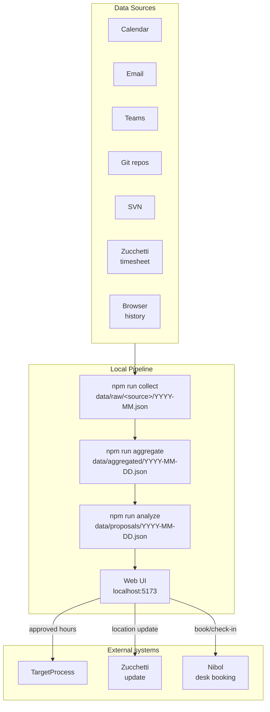
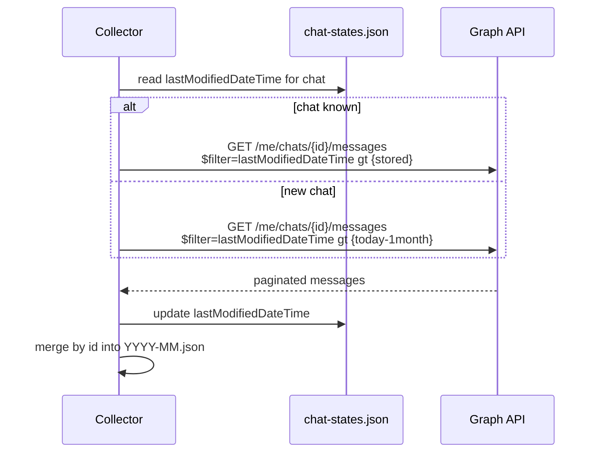
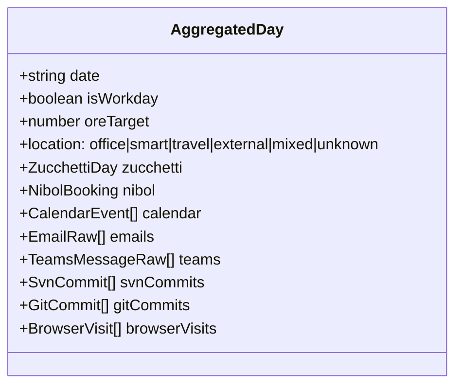
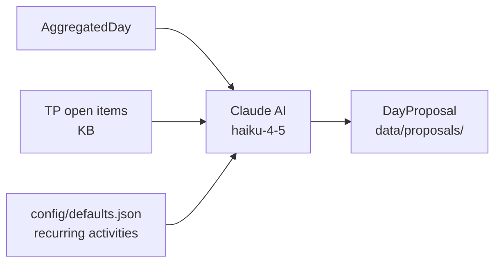
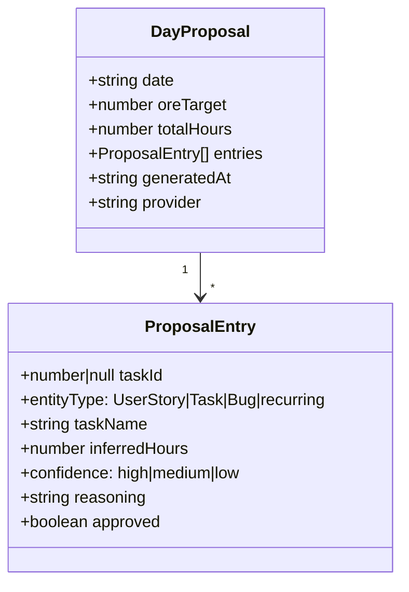
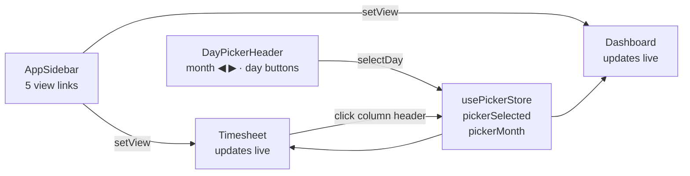
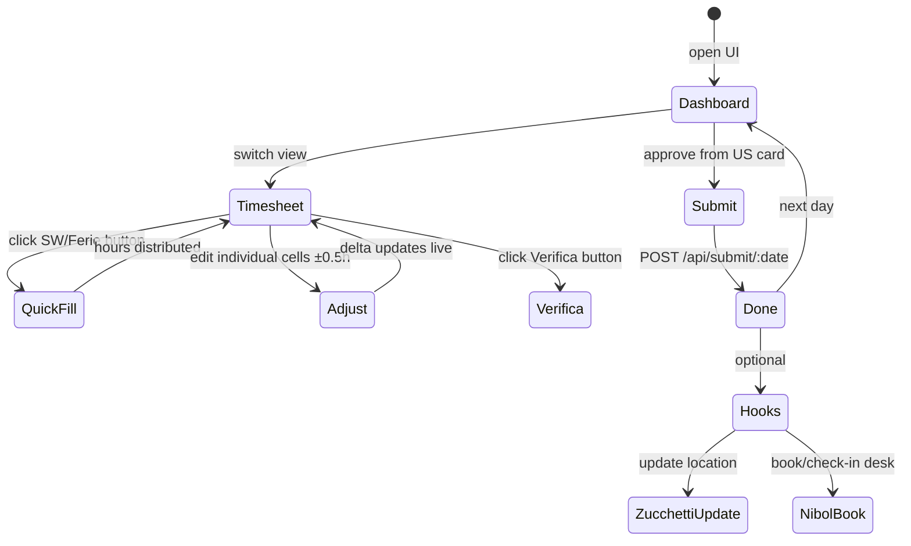
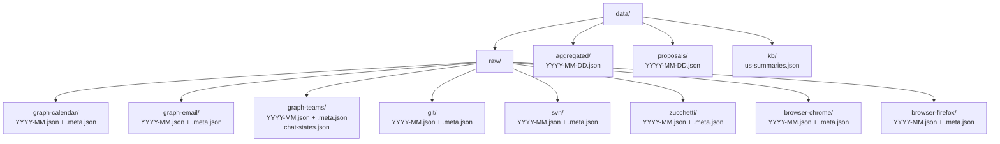

# Functional Overview

→ [README](./README.md) | [Developer guide](./DEVELOPER.md)

---

## Problem statement

Logging hours in TargetProcess manually at the end of the day is error-prone and time-consuming. The question "what did I actually work on today?" requires remembering meetings, conversations, commits, and tasks — context that is already scattered across multiple systems.

This tool collects that context automatically and proposes a time allocation using AI, reducing the daily logging effort to a review-and-click operation.

---

## System overview

---

## Data sources

### Microsoft Graph (Office 365)

| Source | What is collected | Key fields |
|---|---|---|
| **Calendar** | All events in range | subject, start/end, attendees, online flag |
| **Email** | Received messages | subject, sender, received time, body preview |
| **Teams** | Messages from all chats | text, sender, chat topic, created/modified time |

Teams collection is **incremental per chat**: each chat stores the timestamp of the last fetched message; only new or edited messages are downloaded on subsequent runs. Default lookback on first run: **1 month**.

### Version control

| Source | What is collected |
|---|---|
| **Git** | All commits across all repos found under `GIT_ROOTS`. Grouped by month. |
| **SVN** | All commits from `SVN_URL`, fetched month by month. Skipped gracefully when outside VPN. |

### Zucchetti (HR / timesheet)

The official company timesheet is the **ground truth for workdays**:
- Determines whether a day is a workday (vs. weekend, holiday, leave)
- Provides the **target hours** for the day (`hOrd` field)
- Provides the **work location**: office, smart working, or mixed (from `giustificativi`)

### Browser history

Chrome and Firefox SQLite databases are read directly (file copy to avoid lock). Provides URL-level activity as additional context for the AI analyzer.

---

## Aggregation

The aggregator joins all sources by calendar date. Only days present in Zucchetti data are included.

`isWorkday` is derived from Zucchetti: `false` if `orario` is `DOM`/`SAB` or `hOrd` is empty.
`oreTarget` converts `hOrd` (e.g. `"7:42"`) to decimal hours (`7.7`).

---

## AI proposal generation

Claude returns a `DayProposal` where `sum(entries.inferredHours) == oreTarget`:

---

## Web UI — Activity Portal

The frontend is a Vue 3 + Pinia single-page app (`web/`) serving as the daily activity hub.
All state is reactive and persisted to `localStorage`; no page reload is needed between actions.

### Views

| View | Purpose |
|---|---|
| **Dashboard** | Day summary: KPI strip, week strip, timeline, US cards + quick log, signals grid |
| **Timesheet** | Weekly TP timesheet with inline hour editing and Zucchetti comparison |
| **Activity** | Raw activity browser (git, SVN, email, Teams) |
| **Teams** | Teams message explorer |
| **Browser** | Browser history explorer (collapsible) |

### Navigation and day selection

Day picker buttons distinguish three states visually:
- **Today (not selected)**: empty primary ring + dot indicator
- **Selected (not today)**: filled primary pill
- **Today + selected**: filled pill + dot

### Timesheet quick-fill

The timesheet toolbar provides one-click day population across all active TP tasks:

| Button | Hours distributed | Behaviour |
|---|---|---|
| SW 7:42 | 7.7 h | Proportional by `totAllTime` weight; last task absorbs rounding |
| ½ SW | 3.85 h | Same distribution |
| Ferie | 0 h | Clears all active tasks for the day |
| ½ Ferie | 3.85 h | Same as ½ SW from TP perspective |

Standard workday: **7 h 42 min (7.7 h)**. Half day: **3 h 51 min (3.85 h)**.
Defined as `WORKDAY_HOURS` / `HALF_WORKDAY_HOURS` in `web/src/mock/data.ts`.

### Smart ±increment

The `TimeCellWidget` `+`/`−` buttons normally step by 0.5 h. When the day's remaining
delta (`zucHours − tpHours`) satisfies `0 < |delta| < 0.5` and shares the button's sign,
the step is replaced by `delta` so the cell lands exactly on zero without overshooting.

### Timesheet column colour semantics

| Class | Trigger | Visual |
|---|---|---|
| `day-ok` | delta == 0 | Green tint + green ring |
| `day-warn` | tp > 0 but delta ≠ 0 | Amber tint + amber ring |
| `day-err` | tp == 0, zuc > 0 | Red tint + red ring |
| `holiday-col` | `Day.holiday == true` | Purple tint + purple ring |
| `today-col` | column == today in week | Primary outline (non-destructive) |
| `selected-col` | column == pickerSelected | Stronger primary outline (non-destructive) |

`today-col` and `selected-col` use CSS `outline` so they never override `background`
or `box-shadow` from rend / holiday states.

### Submit workflow

---

## TargetProcess integration

| Operation | Endpoint | Notes |
|---|---|---|
| List open items | `GET /api/v1/Assignables` | Filtered by assignee, non-final state |
| Log time | `POST /api/v1/Times` | One POST per approved entry |
| Delete time entry | `DELETE /api/v1/Times/{id}` | Used on re-submit |
| Search items | `GET /api/v1/Assignables?where=Name contains '...'` | Task panel search |

Authentication: Base64-encoded token as `Authorization: Basic <token>`.

---

## Nibol integration

Nibol is the desk booking system. The architecture is split in two parts:

- **Collector** `src/collectors/nibol/index.ts` — called during `npm run collect`, scrapes the Nibol calendar and writes bookings to `data/raw/nibol/YYYY-MM.json`.
- **Standalone scripts** `scripts/nibol/book_desk.ts`, `scripts/nibol/getCalendar.ts` — use Playwright with a persistent browser session to:
  - `bookDesk` — reserve a desk for a given date
  - `checkIn` — confirm presence on arrival

Triggered from the UI via `POST /api/hooks/nibol`.

---

## Storage layout

Each source directory has a `.meta.json` sidecar recording the last extraction date and sources scanned per month — enabling smart skip: completed past months are never re-fetched unless sources change or `--force` is passed.
