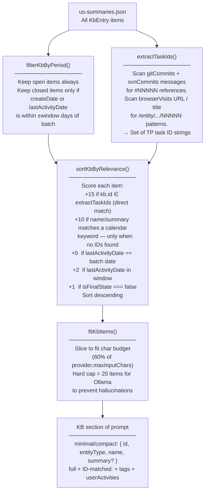
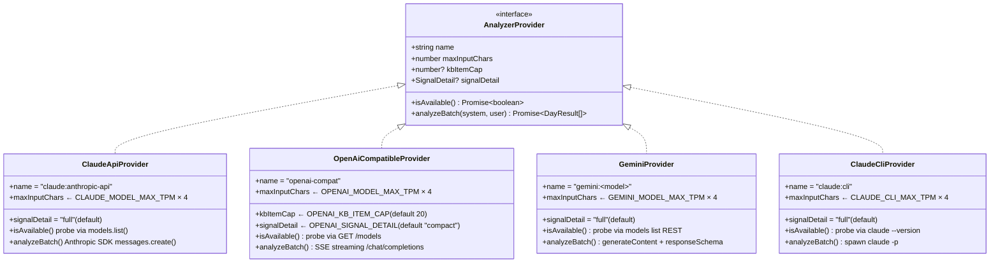
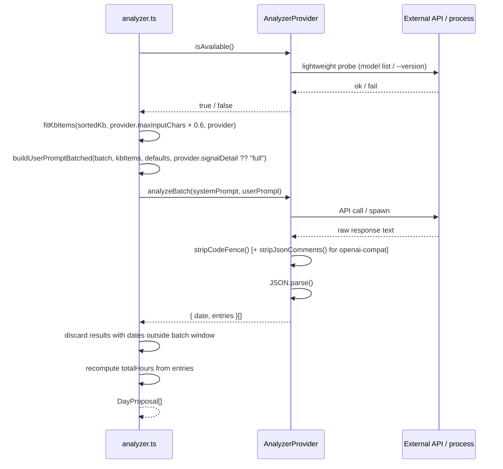
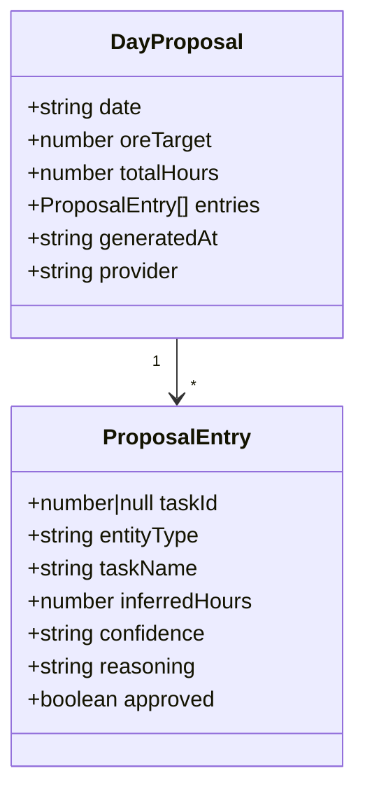
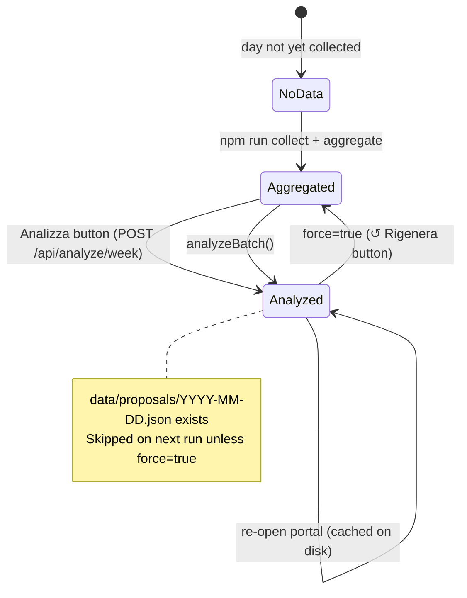

# AI Analysis — Architecture & Data Flow

→ [README](../README.md) | [Operator Runbook](./OPERATOR.md) | [Data Strategy](./DATA-STRATEGY.md)

This document describes the complete AI analysis pipeline: how raw activity signals are collected, aggregated, transformed into an AI prompt, processed by an LLM, and rendered in the frontend.

---

## 1. High-level pipeline

```mermaid
flowchart TD
    subgraph COLLECT["① Collect  —  src/collectors/"]
        C1[Graph Calendar]
        C2[Graph Email]
        C3[Graph Teams]
        C4[Git / SVN]
        C5[Zucchetti]
        C6[Browser]
    end

    subgraph RAW["② Raw files  —  data/raw/&lt;source&gt;/YYYY-MM.json"]
        R1[graph-calendar]
        R2[graph-email]
        R3[graph-teams]
        R4[git · svn]
        R5[zucchetti]
        R6[browser]
    end

    subgraph AGG["③ Aggregate  —  data/aggregated/YYYY-MM-DD.json"]
        A[AggregatedDay]
    end

    subgraph KB["④ Knowledge base  —  data/kb/us-summaries.json"]
        K[KbEntry&#91;&#93;]
    end

    subgraph PROMPT["⑤ Prompt builder  —  analyzer.ts"]
        AN["extractTaskIds / extractCalendarKeywords\nfilterKbByPeriod\nsortKbByRelevance\nfitKbItems  ← provider.kbItemCap\nbuildSignals ← provider.signalDetail\nbuildUserPromptBatched"]
    end

    subgraph CHAIN["⑥ Provider chain  —  AnalyzerProvider&#91;&#93;"]
        P1[ClaudeApiProvider]
        P2[OpenAiCompatibleProvider]
        P3[GeminiProvider]
        P4[ClaudeCliProvider]
        P1 -->|fail| P2
        P2 -->|fail| P3
        P3 -->|fail| P4
    end

    subgraph OUT["⑦ Proposals  —  data/proposals/YYYY-MM-DD.json"]
        PR[DayProposal]
    end

    subgraph FE["⑧ Frontend  —  Vue 3"]
        FE1[Dashboard · AI Proposal card]
        FE2[Timesheet · TpSubmitPopover]
    end

    COLLECT --> RAW
    RAW     --> AGG
    AGG     --> PROMPT
    KB      --> PROMPT
    PROMPT  --> CHAIN
    CHAIN   --> OUT
    OUT     --> FE
```



---

## 2. Raw data sources — fields relevant to AI analysis

### 2.1 Graph Calendar → `CalendarEventRaw`

| Raw field | Aggregated as | Sent to AI | Notes |
|-----------|---------------|------------|-------|
| `subject` | `calendar[].subject` | ✅ full text | Primary signal for meeting-task attribution |
| `start.dateTime` | `calendar[].start.dateTime` | ✅ sliced to `HH:mm` | Used to infer duration |
| `end.dateTime` | `calendar[].end.dateTime` | ✅ sliced to `HH:mm` | — |
| `attendees` | `calendar[].attendees` | ✅ count or name list | **full** mode: first 5 names; **compact/minimal**: count only |
| `isOnlineMeeting` | not forwarded | ❌ | Not in current prompt |
| `organizer` | not forwarded | ❌ | Not in current prompt |

### 2.2 Graph Email → `EmailRaw`

| Raw field | Aggregated as | Sent to AI | Notes |
|-----------|---------------|------------|-------|
| `subject` | `emails[].subject` | ✅ subjects in compact/full | **full**: up to 20 subjects ×100 chars; **compact**: up to 5 ×80 chars; **minimal**: count only (`emailsReceived`) |
| `body`, `from`, `to`, … | dropped | ❌ | Privacy; never forwarded |

### 2.3 Graph Teams → `TeamsMessageRaw`

| Raw field | Aggregated as | Sent to AI | Notes |
|-----------|---------------|------------|-------|
| `chatTopic` | `teams[].chatTopic` | ✅ in compact/full | **full**: `{ topic: count }` map; **compact**: unique topic list; **minimal**: total count only |
| message body | dropped | ❌ | Privacy; never forwarded |

### 2.4 Git commits → `GitCommit`

| Raw field | Aggregated as | Sent to AI | Notes |
|-----------|---------------|------------|-------|
| `repo` | `gitCommits[].repo` | ✅ | Helps attribute to projects |
| `message` | `gitCommits[].message` | ✅ | Full message body (`%B`): subject + blank line + body. Key signal for `#TASKID` extraction |
| `hash`, `author`, `email`, `date` | aggregated | ❌ | Stripped from AI payload |

### 2.5 SVN commits → `SvnCommit`

| Raw field | Aggregated as | Sent to AI | Notes |
|-----------|---------------|------------|-------|
| `message` | `svnCommits[].message` | ✅ | Same role as git commit messages |
| `paths` | `svnCommits[].paths` | ✅ in **full** mode | First 3 paths; stripped in compact/minimal |
| `revision`, `author`, `date` | aggregated | ❌ | Stripped from AI payload |

### 2.6 Zucchetti → `ZucchettiDay`

| Raw field | Aggregated as | Sent to AI | Notes |
|-----------|---------------|------------|-------|
| `hOrd` | `oreTarget` (parsed to decimal) | ✅ | Core constraint: AI must fill exactly this many hours |
| `orario` | `isWorkday` flag | ✅ indirect | `"DOM"`/`"SAB"` → skip day entirely |
| `giustificativi[].text` | `location` (derived) | ✅ as `location` string | `"SMART WORKING"` → `"smart"`, office otherwise |
| `timbrature`, `hEcc`, `richieste` | `zucchetti` field | ❌ | Not forwarded to AI prompt |

### 2.7 Browser history → `BrowserVisit`

| Raw field | Sent to AI | Notes |
|-----------|------------|-------|
| `url` | ✅ **task IDs only** (compact/full) | Regex `/\/entity\/\w+\/(\d{5,6})\b/g` extracts TP task IDs — URL itself never sent |
| `title` | ✅ **task IDs only** (compact/full) | Regex `/#(\d{5,6})\b/g` extracts TP task IDs — title text never sent |
| `visitTime`, host, path | ❌ | Privacy; not forwarded |

---

## 3. Aggregation — `AggregatedDay` construction

```mermaid
flowchart TD
    subgraph Inputs["Monthly raw files (all sources)"]
        I1["graph-calendar/YYYY-MM.json\n→ CalendarEventRaw&#91;&#93;"]
        I2["graph-email/YYYY-MM.json\n→ EmailRaw&#91;&#93;"]
        I3["graph-teams/YYYY-MM.json\n→ TeamsMessageRaw&#91;&#93;"]
        I4["git/YYYY-MM.json\n→ GitCommit&#91;&#93;"]
        I5["svn/YYYY-MM.json\n→ SvnCommit&#91;&#93;"]
        I6["zucchetti/YYYY-MM.json\n→ ZucchettiDay&#91;&#93;"]
        I7["browser-*/YYYY-MM.json\n→ BrowserVisit&#91;&#93;"]
        I8["nibol/ (on-demand only)"]
    end

    subgraph Aggregator["aggregator.ts — per calendar day"]
        AGG["AggregatedDay\n─────────────────\ndate: YYYY-MM-DD\nisWorkday: bool  ← zucchetti.orario\noreTarget: float ← zucchetti.hOrd parsed\nlocation: enum   ← giustificativi keywords\nnibol: NibolBooking | null\nzucchetti: ZucchettiDay | null\ncalendar: CalendarEventRaw&#91;&#93;\nemails: EmailRaw&#91;&#93;\nteams: TeamsMessageRaw&#91;&#93;\ngitCommits: GitCommit&#91;&#93;\nsvnCommits: SvnCommit&#91;&#93;\nbrowserVisits: BrowserVisit&#91;&#93;"]
    end

    subgraph Output["data/aggregated/YYYY-MM-DD.json"]
        OUT[One file per calendar day]
    end

    I1 & I2 & I3 & I4 & I5 & I6 & I7 & I8 --> AGG --> OUT
```



**Location derivation** (from `giustificativi[].text`):

| Zucchetti text contains | `location` value |
|-------------------------|-----------------|
| `SMART WORKING` | `"smart"` |
| `TRASFERTA` | `"travel"` |
| `ESTERNO` | `"external"` |
| Office (no giustificativo) | `"office"` |
| Multiple matching | `"mixed"` |
| No Zucchetti data | `"unknown"` |

---

## 4. KB filtering and ranking

Before the AI prompt is built, the knowledge base (`KbEntry[]`) is reduced to the most relevant items for the batch period.



**Scoring rationale:**
- **+15 for direct ID match**: a commit or browser visit referencing `#NNNNN` is an unambiguous signal — scored highest.
- **+10 for calendar keyword match**: used only as a fallback when no commit/browser task IDs are found (avoids noisy 4-char word matching).
- **Calendar keyword extraction** uses a stopword filter (generic meeting words like `"standup"`, `"weekly"`, `"review"`, Italian equivalents) so only meaningful project-specific words are matched.

**Why the 20-item hard cap for Ollama?**
Small local models (≤8B params) tend to hallucinate task IDs or invent tasks when given long KB lists. Restricting to the top-20 most relevant items drastically reduces fabricated attributions at the cost of slightly lower coverage.

---

## 5. Prompt construction

### 5.1 `SignalDetail` — per-provider verbosity

The `AnalyzerProvider` interface exposes an optional `signalDetail?: "full" | "compact" | "minimal"` field. `buildUserPromptBatched()` accepts this as a parameter and delegates per-day signal serialisation to `buildSignals(day, detail)`.

| Level | Who uses it | Signals included |
|-------|-------------|------------------|
| `"full"` | Claude API, Gemini, Claude CLI (default) | attendees as name list (×5), Teams as `{topic: count}` map, email subjects ×20, SVN paths, browser task IDs, KB tags + userActivities for ID-matched tasks |
| `"compact"` | OpenAI-compat / Ollama (default) | attendees as count, Teams unique topic list, email subjects ×5 ×80 chars, browser task IDs (no SVN paths, no KB extras) |
| `"minimal"` | explicit opt-in via env | current pre-enrichment behaviour: attendee count, Teams count, email count — no subjects/topics/browser |

The `signalDetail` default is `"full"` — providers that do **not** declare the field are treated as full.

### 5.2 Prompt structure

```mermaid
flowchart LR
    subgraph SystemPrompt["SYSTEM_PROMPT (static)"]
        SP["Rules:\n1. Output ONLY valid JSON array\n2. One object per day\n3. date + entries fields\n4. Sum of inferredHours == oreTarget\n5. Use all signals to infer tasks\n6. Distribute remaining hours\n7. Keep pre-seeded entries\n8. Skip pre-seeded only if signals\n   explicitly contradict them"]
    end

    subgraph UserPrompt["buildUserPromptBatched(days, kb, defaults, signalDetail)"]
        UP_KB["activeTasks: KbEntry&#91;&#93;\n(filtered + sorted + fitted)\nfull+idMatch: + tags + userActivities\nothers: { id, entityType, name, summary? }"]
        UP_DAYS["days&#91;&#93;:\n  date\n  oreTarget\n  remainingHours  ← oreTarget − recurring\n  location\n  signals: buildSignals(day, signalDetail)\n  preSeededEntries&#91;&#93;  ← from defaults.json"]
        UP_INS["instruction: userInstruction()"]
    end

    SystemPrompt --> Provider
    UP_KB & UP_DAYS & UP_INS --> Provider["AI Provider\n(JSON.stringify → string)"]
```



### 5.3 `buildSignals()` output by detail level

| Signal key | `minimal` | `compact` | `full` |
|------------|-----------|-----------|--------|
| `calendarEvents[].subject` | ✅ | ✅ | ✅ |
| `calendarEvents[].attendees` | count | count | name list ×5 |
| `teamsMessages` | count | — | `{topic: count}` map |
| `teamsTopics` | — | unique list | — |
| `gitCommits[].repo + message` | ✅ | ✅ | ✅ |
| `svnCommits[].message` | ✅ | ✅ | ✅ |
| `svnCommits[].paths` | — | — | first 3 |
| `emailsReceived` | count | — | — |
| `emailSubjects` | — | ×5 ×80 chars | ×20 ×100 chars |
| `browserTaskIds` | — | ✅ | ✅ |

### 5.4 What is stripped from the prompt

| Field present in `AggregatedDay` | Reason for exclusion |
|----------------------------------|----------------------|
| `browserVisits[].url/title` (raw) | Only task IDs extracted; full URLs/titles never sent |
| `emails[].body/from/to` | Privacy; only subjects forwarded in compact/full |
| `teams[].body.content` | Privacy; only topic forwarded |
| `gitCommits[].hash/author/email/date` | Redundant; `message` + `repo` is sufficient |
| `svnCommits[].revision/author/date` | Same as above |
| `zucchetti.*` (raw fields) | Already translated to `oreTarget` + `location` |
| `nibol.*` | Not relevant for task attribution |

---

## 6. `AnalyzerProvider` interface — common contract

All four provider implementations satisfy the same interface defined in `src/analysis/base.ts`. `analyzer.ts` never calls a provider directly — it only calls through the interface. This makes switching or adding providers transparent.



**Common execution flow** — identical for every provider, enforced in `analyzeBatch()`:



**Where providers differ** (all other steps are identical):

| Step | ClaudeApiProvider | OpenAiCompatibleProvider | GeminiProvider | ClaudeCliProvider |
|------|-------------------|--------------------------|----------------|-------------------|
| Transport | Anthropic SDK | `fetch` SSE stream | `@google/genai` SDK | `spawn("claude", ["-p"])` |
| Structured output | ❌ (text + JSON.parse) | ❌ (+ stripJsonComments) | ✅ `responseSchema` | ❌ (text + JSON.parse) |
| Token usage logging | ✅ `input_tokens` / `output_tokens` | token count from stream | ❌ | ❌ |
| `kbItemCap` | ∞ (not declared) | **20** via `OPENAI_KB_ITEM_CAP` | ∞ (not declared) | ∞ (not declared) |
| `signalDetail` | `"full"` (default) | `"compact"` via `OPENAI_SIGNAL_DETAIL` | `"full"` (default) | `"full"` (default) |
| Timeout env var | — | `OPENAI_REQUEST_TIMEOUT_MS` | — | — |

---

## 6b. Provider chain and token budgets


| Provider | Default token budget | Env var | Notes |
|----------|---------------------|---------|-------|
| `ClaudeApiProvider` | 200 000 tokens → 800 000 chars | `CLAUDE_MODEL_MAX_TPM` | Anthropic API SDK |
| `OpenAiCompatibleProvider` | 5 000 tokens → 20 000 chars | `OPENAI_MODEL_MAX_TPM` | Ollama/LM Studio; SSE streaming |
| `GeminiProvider` | 1 000 000 tokens → 4 000 000 chars | `GEMINI_MODEL_MAX_TPM` | Structured output via `responseSchema` |
| `ClaudeCliProvider` | 200 000 tokens → 800 000 chars | `CLAUDE_CLI_MAX_TPM` | Claude Code subscription |

**Batch sizing:** The orchestrator uses the most restrictive active provider's budget to fit as many days as possible per API call, flushing the batch when the projected prompt exceeds the budget. The **sizing probe** now uses:
1. `filterKbByPeriod` + `sortKbByRelevance` on the candidate batch
2. `fitKbItems` with 60% of the restrictive provider's budget → realistic KB subset
3. `buildUserPromptBatched` with the restrictive provider's `signalDetail` → accurate char count

This prevents under-estimation: previously the probe used the full KB list with the old fixed signal shape.

**Hallucination mitigations for local models (Ollama):**
- KB hard cap of 20 items (`fitKbItems`)
- `signalDetail = "compact"` caps emails to 5 subjects ×80 chars and teams to unique topic list
- `stripJsonComments` removes `//` comments injected by models like qwen2.5-coder
- Date validation: results with dates outside the batch window are silently discarded
- SSE streaming (`stream: true`) prevents proxy/OS TCP timeouts on long inference

**Gemini specifics:**
- Uses `responseMimeType: "application/json"` + `responseSchema` for structured output — eliminates code fences and malformed JSON entirely
- System prompt merged into user content (Gemini v1beta does not have a separate system role)

---

## 7. AI output — `DayProposal` and `ProposalEntry`




**`entityType` values:** `UserStory` | `Task` | `Bug` | `recurring`

**`confidence` values:** `high` | `medium` | `low`

**Constraint enforced in prompt:** `sum(entries[].inferredHours) === oreTarget`

The orchestrator validates results post-parse:
- Dates outside the batch window → discarded (hallucination guard)
- `totalHours` is recomputed from entries (not trusted from model output)

---

## 8. Frontend consumption

```mermaid
flowchart TD
    API["GET /api/day/:date\n(Express — src/server/routes/day.ts)"]
    STORE["useDayStore.ts\nactiveTasks computed:\n  commits = git&#91;dayIdx&#93; + svn&#91;dayIdx&#93;\n  meetings = calEvents.length\n  proposal = DayProposal from /api/day"]
    TS_STORE["useTimesheetStore.ts\nhoursEdits: Map&lt;tpId_dayIdx, hours&gt;\nbuildEdits() → TP submission payload"]

    subgraph Dashboard["Dashboard view"]
        D1["StatStrip · AI Proposal card\n→ provider, generatedAt, entry count"]
        D2["StatStrip · Commits card\n→ git+svn count for selected day"]
        D3["DayTimeline\n→ calendar events"]
    end

    subgraph Timesheet["Timesheet view"]
        T1["TsRow (pinned rows)\n→ commit dots per day\n→ hh:mm hours\n→ TsNoteCell per day"]
        T2["TsTpBar · Analizza\n→ POST /api/analyze/week/:date\n→ polls /api/analyze/status/:jobId"]
        T3["TpSubmitPopover\n→ review pending edits\n→ POST /api/tp/time-entries"]
    end

    API --> STORE --> D1 & D2 & D3
    API --> TS_STORE --> T1 & T3
    T2 -->|force=true| API
```



### VCS signal attribution (client-side)

Commit messages are parsed client-side in `useTimesheetStore.fetchWeekData()` using:

```
/#(\d{5,6})\b/g
```

This maps each git/svn commit to the TP task IDs found in its message, building `TsRow.git[dayIdx]` and `TsRow.svn[dayIdx]` count arrays. These drive the commit dot badges in pinned rows and the `commits` count in `StatStrip`.

### Proposal → timesheet pre-fill flow

Currently proposals are read via `/api/day/:date` and displayed in the **AI Proposal** card on the Dashboard. Direct pre-population of `hoursEdits` from proposal entries is a planned feature (not yet implemented).

---

## 9. Data freshness and re-analysis triggers



**API endpoints for analysis:**

| Endpoint | Method | Description |
|----------|--------|-------------|
| `/api/analyze/:date` | POST | Analyze single day (202 + jobId) |
| `/api/analyze/week/:date` | POST | Analyze all workdays in week (202 + jobId) |
| `/api/analyze/status/:jobId` | GET | Poll job status |
| `/api/sync` | POST | Re-collect Zucchetti + Nibol + re-aggregate for day/week |
