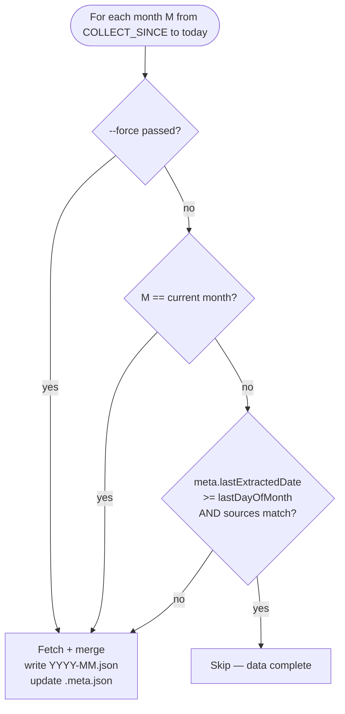
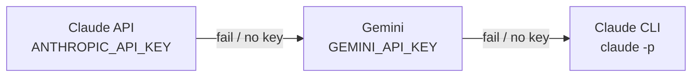

# Data Collection and Analysis Strategy

→ [Developer Guide](../DEVELOPER.md) | [Operator Runbook](./OPERATOR.md)

This document describes how each data source is collected, when it should be refreshed, and the current state of caching at each pipeline stage.

---

## Collection strategy by source

| Source | Output path | Frequency | Immutability | Skip logic | Notes |
|--------|-------------|-----------|-------------|-----------|-------|
| **Graph Calendar** | `data/raw/graph-calendar/YYYY-MM.json` | Monthly iteration from `COLLECT_SINCE` to today | Past months frozen once `lastExtractedDate >= lastDayOfMonth` | `.meta.json` sidecar | Current month always re-fetched |
| **Graph Email** | `data/raw/graph-email/YYYY-MM.json` | Monthly | Same as Calendar | `.meta.json` sidecar | Current month always re-fetched |
| **Graph Teams** | `data/raw/graph-teams/YYYY-MM.json` | Incremental per-chat | Append-only (messages merged by id) | `chat-states.json` per chat | 600+ chats paginated; only fetches messages newer than stored `lastModifiedDateTime` |
| **Git commits** | `data/raw/git/YYYY-MM.json` | Monthly | Past months frozen | `.meta.json` sidecar | Scans `GIT_ROOTS` env var; filters by `GIT_EMAILS` |
| **SVN commits** | `data/raw/svn/YYYY-MM.json` | Monthly | Past months frozen | `.meta.json` sidecar | Fails gracefully without VPN; marks month complete with `[]` |
| **Zucchetti** | `data/raw/zucchetti/YYYY-MM.json` | Monthly | Past months frozen | `.meta.json` sidecar | Current month always re-fetched; Playwright automation |
| **Browser Chrome** | `data/raw/browser-chrome/YYYY-MM.json` | Monthly | Past months frozen | `.meta.json` sidecar | Reads SQLite; Chrome timestamps in FILETIME microseconds |
| **Browser Firefox** | `data/raw/browser-firefox/YYYY-MM.json` | Monthly | Past months frozen | `.meta.json` sidecar | Reads SQLite; Firefox timestamps in Unix microseconds |
| **Nibol** | Not stored in data/ | On-demand | N/A | None | Desk booking automation only; calendar data fetched for diagnostics |

### Skip / force logic (all monthly sources)

Teams uses `chat-states.json` instead of `.meta.json` — each chat stores its own `lastModifiedDateTime` checkpoint and fetches only newer messages on subsequent runs.

---

## Aggregation strategy

**File:** `src/analysis/aggregator.ts`
**Output:** `data/aggregated/YYYY-MM-DD.json` — one file per calendar day

The aggregator reads all monthly JSON files from every raw source directory using `loadDirMonthly<T>(dir)` and joins them into per-day `AggregatedDay` bundles.

### Current behavior

| Aspect | Current state |
|--------|---------------|
| Skip logic | **None** — all days are rebuilt on every run |
| Caching | **None** — output files are always overwritten |
| Trigger | Manual (`npm run aggregate`) or via `npm run all` |

### Known gap: no hash-based skip

The aggregator always overwrites all `data/aggregated/` files regardless of whether the input data has changed. On large history ranges this is wasteful. A future improvement would compute a hash of the input data per day and skip regeneration when the hash matches the existing output.

**Recommended rule:** Aggregated files for past months (where all raw sources are frozen) never need to be regenerated. Only the current month needs re-aggregation after each collection run.

---

## Analysis strategy

**File:** `src/analysis/analyzer.ts`
**Output:** `data/proposals/YYYY-MM-DD.json` — one file per workday

The analyzer reads aggregated day files and the TP user story knowledge base (`data/kb/us-summaries.json`), then calls an AI provider to generate `DayProposal` entries.

### Provider fallback chain

A `--provider=` flag forces a specific provider. Fatal errors (e.g. credit balance exhausted) abort immediately without trying the next provider.

### Current skip logic

| Condition | Behavior |
|-----------|----------|
| `data/proposals/YYYY-MM-DD.json` exists | **Skip** — day already analyzed |
| `--force` flag passed | Always re-analyze |
| Non-workday (weekend, holiday) | Skip |

### Known gap: file-existence-only skip

The current check only tests whether the proposals file exists. It does not compare the content of the aggregated input — if new raw data was collected and the aggregated file was updated, the existing proposals file will NOT be regenerated automatically (unless `--force` is passed).

**Recommended improvement:** Store a hash of the input `AggregatedDay` inside the proposals file. On subsequent runs, re-analyze only if the hash has changed.

---

## Recommended operational schedule

| Task | Suggested frequency | Command |
|------|--------------------|---------|
| Collect all sources | Daily (weekdays) — or via morning automation | `npm run collect` |
| Aggregate | After each collection run | `npm run aggregate` |
| Analyze current week | Once per day, afternoon | `npm run analyze` (via portal Analizza button) |
| Update TP knowledge base | Weekly or after sprint planning | `npm run kb:update` |
| Force re-collect current month | When data looks stale | `npm run collect -- --force` |
| Full pipeline | Monday morning to catch up | `npm run all` |

---

## Data immutability rules

1. **Past months** (fully elapsed calendar months): raw files are considered frozen once `lastExtractedDate >= lastDayOfMonth`. Re-collection is skipped unless `--force` is passed.
2. **Current month**: always re-fetched, since events can still be added or modified.
3. **Aggregated files**: no immutability enforcement currently. Rebuilding is idempotent — the same inputs produce the same output.
4. **Proposals files**: treated as final once written. Re-analysis requires `--force` or deleting the file.
5. **TargetProcess time entries**: once submitted via the portal, they exist in TP. Corrections must be made in TP directly (delete + re-submit). The portal does not support editing existing time entries.

---

## Token optimization for AI analysis

Re-analyzing already-analyzed days burns API tokens unnecessarily. Current mitigations:

- File-existence check skips already-analyzed workdays.
- `--force` is required to re-analyze — accidental re-runs are prevented.

Planned improvements (not yet implemented):

- Hash-based skip at the aggregator level: skip days where input data has not changed.
- Hash stored inside proposals files: re-analyze only when the aggregated input hash changes.
- Weekly batch mode: analyze only days with new data since the last analysis run.
