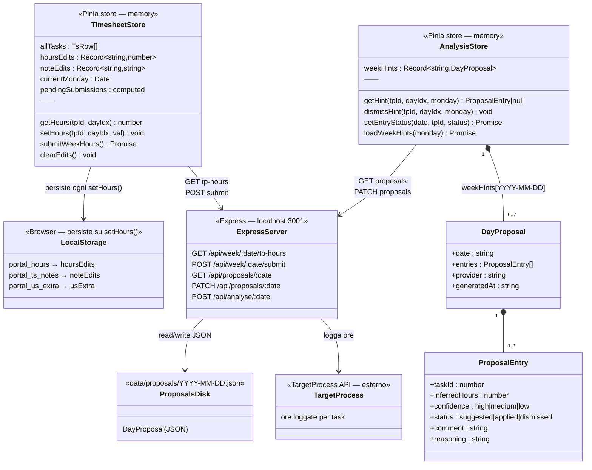
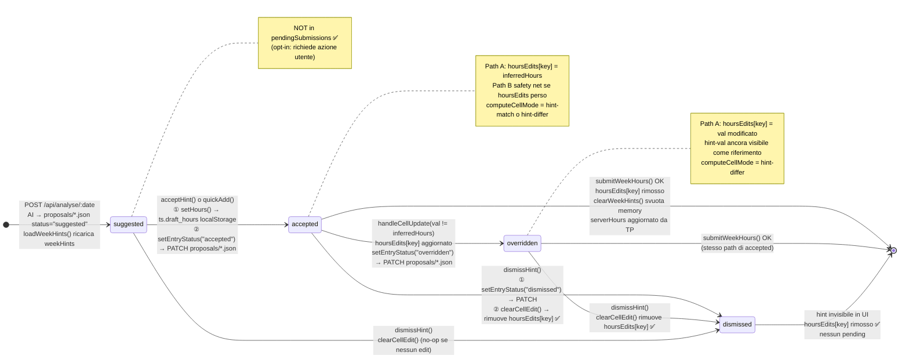
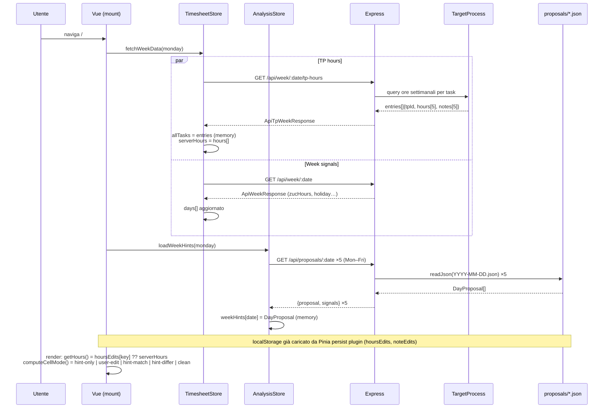
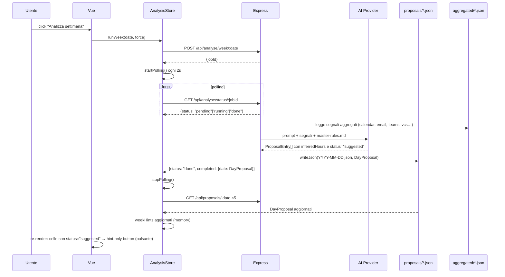
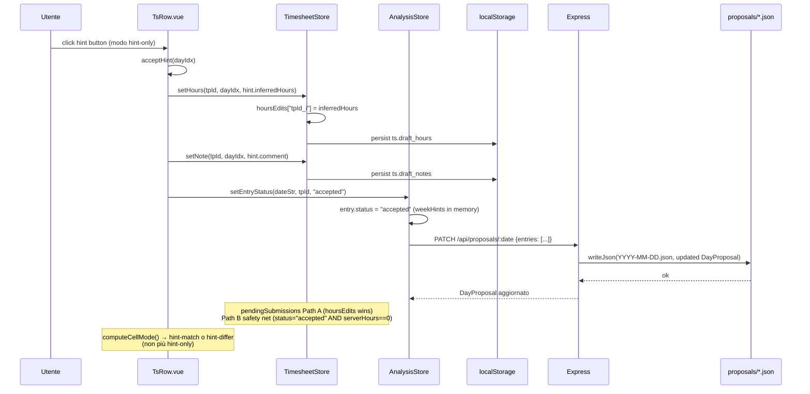
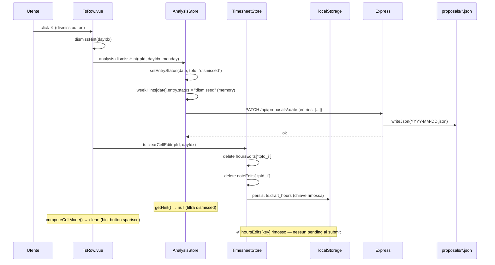
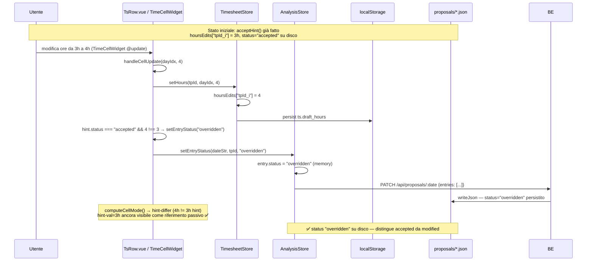
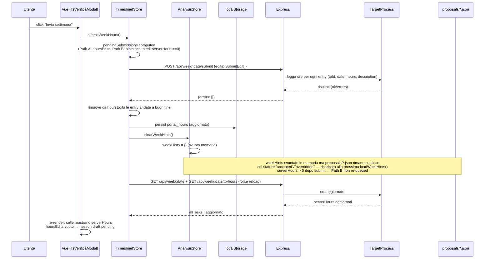

# FE Hours — Diagrammi architetturali

**Scope:** hint AI, draft locali, sincronizzazione FE↔BE↔TP  
**Complementare a:** `fe-hours-state-analysis.md`

---

## 1. Struttura dati e layer di persistenza

### Chiave: cosa vive dove

| Dato | Dove | Quando scritto | Quando letto |
|------|------|----------------|--------------|
| `allTasks[].hours[]` | memory (Pinia) | `fetchWeekData()` | `getHours()` fallback |
| `hoursEdits[tpId_i]` | **localStorage** `portal_hours` | ogni `setHours()` | `getHours()` priority, `pendingSubmissions` Path A |
| `noteEdits[tpId_i]` | **localStorage** `portal_ts_notes` | ogni `setNote()` | `getNote()` |
| `weekHints[date]` | memory (Pinia) | `loadWeekHints()` | `getHint()`, `pendingSubmissions` Path B |
| `ProposalEntry.status` | **disk** `data/proposals/*.json` | `setEntryStatus()` via PATCH | `loadWeekHints()` su mount / post-analisi |
| ore loggate | **TargetProcess** | `submitWeekHours()` | `fetchTpWeekHours()` |

---

## 2. Ciclo di vita di un hint — stato post-fix

---

## 3. Sequence: caricamento settimana

---

## 4. Sequence: richiesta analisi AI

---

## 5. Sequence: accept hint

---

## 6. Sequence: dismiss hint

---

## 7. Sequence: modifica ore post-accept

---

## 8. Sequence: submit settimana

---

## 9. Logic di `pendingSubmissions` — decision tree

```mermaid
flowchart TD
    A[per ogni row × dayIdx] --> B{hoursEdits<br />tpId_i esiste?}
    B -- sì --> C[Path A<br />targetHours = hoursEdits<br />key]
    B -- no --> D{getHint<br />retorna hint?}
    D -- no / dismissed --> SKIP[skip]
    D -- sì --> E{hint.status<br />== accepted?}
    E -- no --> SKIP
    E -- sì --> F{serverHours<br />> 0?}
    F -- sì --> SKIP
    F -- no --> G[Path B safety net<br />targetHours = hint.inferredHours<br />isHint = true]
    C --> H{abs targetHours<br />- serverHours < 0.05?}
    G --> H
    H -- sì --> SKIP
    H -- no --> INCLUDE[include in pendingSubmissions]

    style B fill:#2d4a6b
    style E fill:#2d4a6b
    style F fill:#2d4a6b
    style H fill:#2d4a6b
    style SKIP fill:#3a3a3a
    style INCLUDE fill:#1a5c1a
    style G fill:#5c3a1a
    style C fill:#1a3d5c
```

---

## Riepilogo bug / gap — stato implementazione

| # | Bug/Gap | Path | Stato |
|---|---------|------|-------|
| B1 | hint `suggested` auto-queued senza azione utente | Path B | ✅ Path B filtra `status !== "accepted"` |
| B2 | `dismissHint()` non pulisce `hoursEdits` | Path A | ✅ `dismissHint()` chiama `clearCellEdit()` |
| B3 | nessuno stato `overridden` per accept+modifica | Path A | ✅ `handleCellUpdate()` → `"overridden"` su disco |
| B4 | `TsVerificaModal` mostra `getHours()` non `serverHours` | display | ✅ colonna "TP ora" (`serverTotalsRow`) + "Da inviare" |
| B5 | `hours: 0` invia delete silenzioso su entry TP esistente | Path A | ✅ `isDelete` flag + alert rosso nel modal |

**Residuo:** layer `acceptedHints` separato da `hoursEdits` (B3 full refactor) — non implementato. `hoursEdits` contiene ancora sia edit manuali che valori accepted; il tipo su disco (`accepted`/`overridden`) li distingue.
